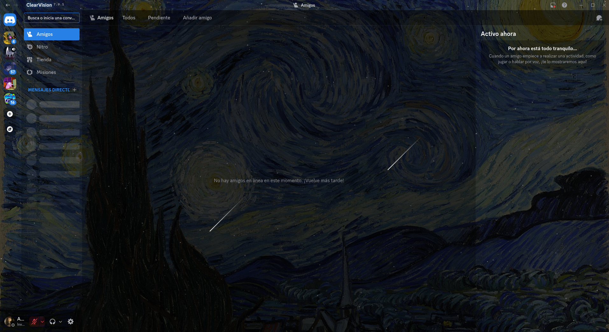
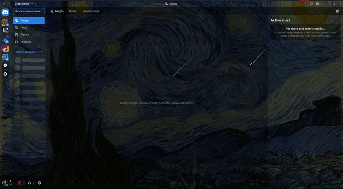

# StarryNight para BetterDiscord

Un plugin inmersivo para BetterDiscord que transforma tu cliente en la obra maestra de Vincent van Gogh "La Noche Estrellada" de Vincent van Gogh, combinando arte estático con animaciones dinámicas generadas por código.

##  Características (Features)

* **Fondo de Alta Resolución:** Utiliza una versión HD de la pintura original de Van Gogh, inyectada en la raíz del cliente.
* **Campo Estelar Dinámico (JS):** Genera de forma asíncrona cientos de estrellas parpadeantes de diferentes tamaños. El algoritmo detecta la resolución de tu pantalla y ajusta la cantidad de estrellas automáticamente.
* **Estrellas Fugaces (CSS):** Implementa animaciones suaves y periódicas de estrellas fugaces que cruzan el lienzo de fondo.
* **Acentos Azules Integrados:** Sobrescribe las variables nativas de Discord para teñir los botones, enlaces y selecciones activas de un azul brillante (`#2d7dff`), logrando que la interfaz combine perfectamente con el cielo de la obra.

---

## Demostración en vivo

> *El cielo nocturno cobra vida con animaciones sutiles y elegantes.*

---

## Requisito Obligatorio

Este plugin **no** gestiona la transparencia profunda de los paneles de Discord. Para que la obra de arte y las animaciones no queden ocultas detrás de los menús grises, **es absolutamente necesario usar un tema base de transparencia**.

El plugin detectará automáticamente tu tema, pero se recomienda y soporta oficialmente **ClearVision V7**, el cual puedes descargar directamente desde la tienda de temas de BetterDiscord.

---

## Instrucciones de Instalación

1. Asegúrate de tener instalado [BetterDiscord](https://betterdiscord.app/).
2. Descarga e instala el tema [ClearVision V7](https://betterdiscord.app/theme/ClearVision) (disponible en la tienda oficial de BetterDiscord). Actívalo en la pestaña de Temas de Discord.
3. Descarga la última versión del archivo `StarryNight.plugin.js` desde la sección de *Releases* o copiando el código fuente de este repositorio.
4. Abre Discord, ve a **Ajustes de Usuario > BetterDiscord > Plugins** y haz clic en "Abrir carpeta de Plugins".
5. Mueve el archivo `StarryNight.plugin.js` a esa carpeta.
6. Enciende el interruptor de StarryNight en tu lista de plugins.

---

##  Detalles Técnicos

* **Versión actual:** 1.0.0
* **Autor:** Alexander(softwaredecafe)
* **Funcionamiento:** Utiliza la API moderna de BetterDiscord (`BdApi.DOM.addStyle`) con fallbacks a la API antigua para inyectar CSS. Emplea manipulación directa del DOM para inyectar contenedores `div` asíncronos y aislados (`z-index: 0`) que no interfieren con los clics ni el rendimiento de la aplicación principal.

##  Créditos

* **Tema de compatibilidad:** [ClearVision Team](https://github.com/ClearVision/ClearVision-v6).